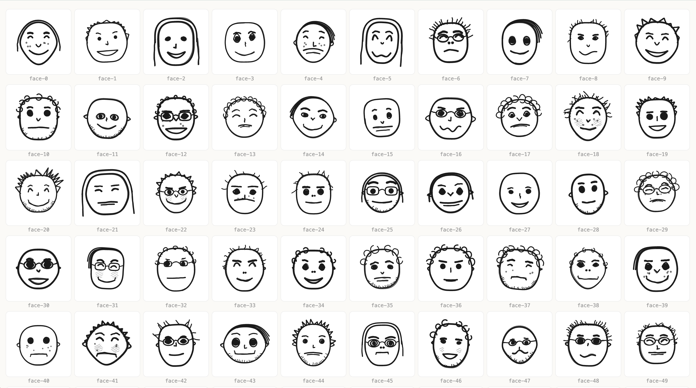
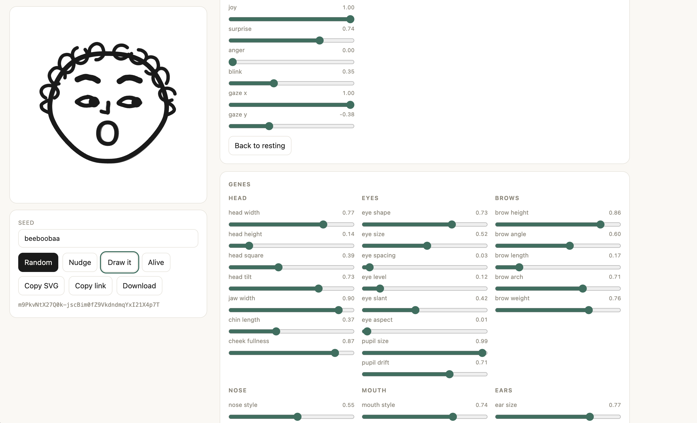
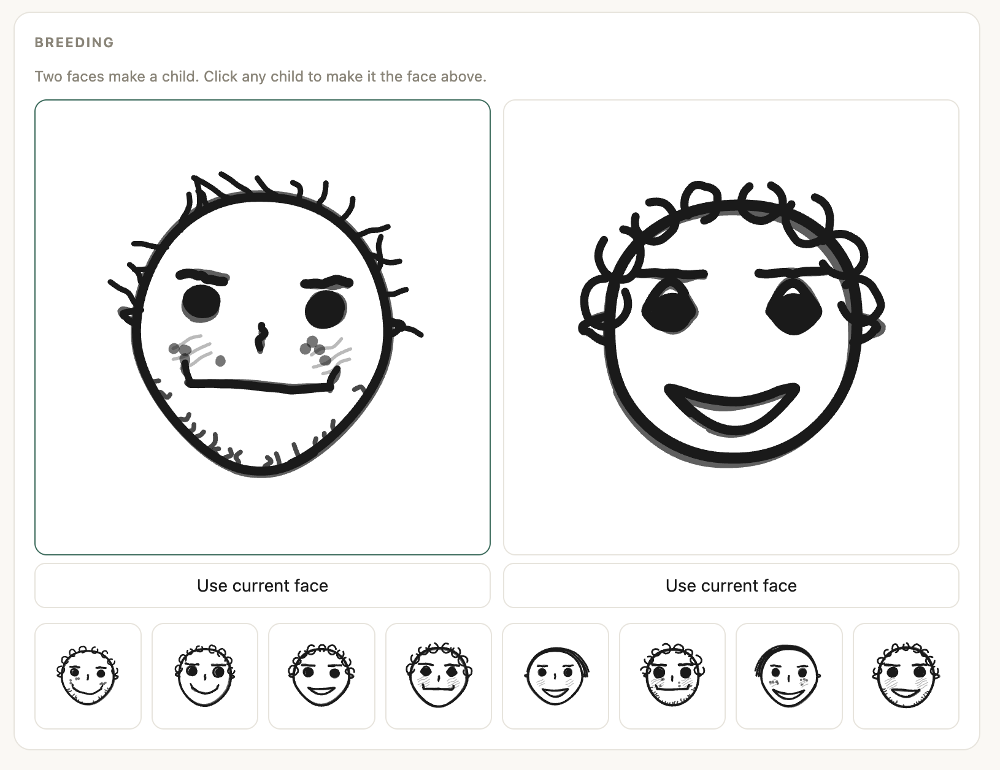

# doodle-face

Turn any string into a unique hand-drawn face. No dependencies, no build step, no
image assets. The faces are generated from geometry and drawn as SVG paths.

[Live demo](https://hasantayyar.github.io/doodle-face/) ·
[Releases](https://github.com/hasantayyar/doodle-face/releases) ·
[Source](https://github.com/hasantayyar/doodle-face)


[](https://github.com/hasantayyar/doodle-face/actions/workflows/ci.yml)
[](https://github.com/hasantayyar/doodle-face/actions/workflows/pages.yml)
[](LICENSE)


```js
import { face } from "doodle-face";

document.body.innerHTML = face("hasan");
```

The same input always produces the same face, byte for byte, in the browser and in
Node.



## Demo

https://github.com/user-attachments/assets/ab3d2fed-3c8c-44df-a73c-012f7e815a2a

The playground is the demo: seed a face, drag genes, change expression, breed two
faces, copy the SVG. It is the same module the library ships.

- Public site: https://hasantayyar.github.io/doodle-face/
- Locally: `npm run playground` then open http://localhost:5173

The URL hash is the genome code, so any face you land on is a shareable link.



Two faces breed into a row of children. Click a child to load it.



## Install

```bash
npm install doodle-face
```

GitHub Releases also ship an npm tarball plus a zip of `src/`:

```bash
npm install github:hasantayyar/doodle-face#v0.1.2
```

Or copy `src/` into your project. It is plain ES modules with no imports outside
itself.

## Why it looks drawn

Nothing here is a pre-drawn asset being recombined. Features are built as
parametric curves and then every one of them goes through a single "hand" pass
that makes it look like ink:

- the line wanders along its own normal using low-frequency noise, so it drifts
  rather than buzzes
- each stroke is drawn twice with independent noise and a small registration
  offset, which is the thing that actually reads as pen on paper
- closed shapes overshoot instead of meeting exactly, because hand-drawn circles
  never close

Because it is all geometry, variation is continuous rather than combinatorial.
There is no finite set of noses.

## The genome

A face is a fixed-length array of floats in `[0, 1]`, one per trait. Everything
else falls out of that representation:

```js
import { face, genomeFromSeed, encode, decode, breed, mutate, GENES } from "doodle-face";

genomeFromSeed("hasan");   // a genome from any string
encode(genome);            // "D7BmirMTIHGGrIBaln2XCMHqXRJCq-yQe8CqRPgzF"
decode(code);              // and back again
breed(momGenome, dadGenome);
mutate(genome, 0.1);
GENES;                     // every trait name, in order
```

`face()` accepts a seed string, a genome code, a genome array, or a plain object
of gene names, so all of these draw something sensible:

```js
face("hasan");
face("D7BmirMTIHGGrIBaln2XCMHqXRJCq-yQe8CqRPgzF");
face(breed("alice", "bob"));
face({ eyeSize: 0.9, mouthWidth: 0.2 });   // unnamed genes default to 0.5
```

The encoded form is 41 URL-safe characters, one per gene at 6 bits of precision.
It round-trips, so it is safe to put in a URL or a database column.

## Expression is separate from identity

The genome decides who the face is. Expression is a second, independent input, so
one face can react without becoming a different face.

```js
face("hasan", { expression: { joy: 1 } });
face("hasan", { expression: { joy: -0.6, anger: 0.8 } });
face("hasan", { expression: { surprise: 1 } });
face("hasan", { expression: { blink: 1 } });
face("hasan", { expression: { gaze: { x: -1, y: 0.3 } } });
```

| key | range | effect |
| --- | --- | --- |
| `joy` | `-1`..`1` | mouth curve, eye squint, brow lift |
| `surprise` | `0`..`1` | wider eyes, raised brows, open mouth |
| `anger` | `0`..`1` | brows angled inward, eyes narrowed |
| `blink` | `0`..`1` | eyelids closing |
| `gaze` | `{x, y}` or `[x, y]`, each `-1`..`1` | where the pupils point |

Leave `joy` out and the face uses its own resting mood, taken from its `mood`
gene. Everything else defaults to neutral. Values outside the ranges are clamped.

Gaze needs pupils to move, so it has no effect on the eye shapes that do not have
any (dot and single-curve eyes).

## Options

```js
face(input, {
  size: 256,               // omit to let CSS size it
  expression: { joy: 1 },
  color: "#1a1a1a",        // a presentation attribute, so CSS still wins
  background: "#fff",      // default is transparent
  draw: 1200,              // self-draw animation, in ms; true means 1200
  title: "Hasan",          // adds <title> and role="img" for screen readers
  className: "avatar",
  style: { strokeWidth: 3, roughness: 2 },
  strokeWidth: 2,
  roughness: 1.5,
  inkSeed: "pinned",       // see below
});
```

`color` is emitted as an attribute and every stroke uses `currentColor`, so a face
inherits the surrounding text colour and can be recoloured with one CSS rule.

`draw` emits a `stroke-dasharray` animation so the face draws itself, stroke by
stroke, in the order a person would.

`inkSeed` pins the hand-drawn wobble. By default it is derived from the genome, so
a face is entirely determined by its genes, but that means changing one gene
re-inks the whole drawing. Pin it while animating a gene or dragging a slider and
only the feature you are changing will move.

## Other entry points

```js
import { strokes, faceDataUri } from "doodle-face";

faceDataUri("hasan");   // data: URI for an  or CSS background
strokes("hasan");       // { strokes, layout, style, viewBox }, no SVG
```

`strokes()` returns the path data and pen settings without any SVG around them,
which is what a canvas or native renderer would want.

## Development

```bash
npm test              # node --test, no dependencies
npm run size          # per-file size report against the budget
npm run playground    # http://localhost:5173
npm run site          # write the GitHub Pages tree to ./site
npm run grid          # writes out/grid.html, a contact sheet of 100 faces
```

The contact sheet is the important one for aesthetics. Faces have to be judged in
bulk, because any single seed can look fine by luck.

How to add a feature, what CI expects, and how to review a visual change:
[CONTRIBUTING.md](CONTRIBUTING.md).

## Publishing

This repository does two things from `main`:

| What | How |
| --- | --- |
| Demo site | GitHub Pages, from the `Pages` workflow on every push to `main` |
| Library | npm and GitHub Releases, from the `Release` workflow on a version tag |

### First-time Pages setup

After the first push, in the GitHub repo: **Settings → Pages → Source → GitHub
Actions**. The next `main` push deploys https://hasantayyar.github.io/doodle-face/.

### Cutting a library release

1. Bump `"version"` in `package.json`.
2. Commit, then tag the same number:

```bash
git tag v0.1.2
git push origin main --tags
```

The tag must match `package.json` (`v0.1.2` for `"version": "0.1.2"`). The workflow
runs the tests, publishes to npm, packs `npm pack`, zips `src/`, and creates a
GitHub Release with those two files. Previously unpublished versions (`0.1.0`,
`0.1.1`) cannot be reused.

## Size

Zero dependencies, and `src/` gzips to:

| | raw | gzipped |
| --- | --- | --- |
| as written, comments and all | 49.8 KB | 16.1 KB |
| comments and blank lines stripped | 34.7 KB | 10.5 KB |

There is no minifier in this project, so no mangled-identifier figure is quoted.
A bundler running one would land below the stripped number.

## Layout

```
src/                 the library (what a release ships)
playground/          demo; GitHub Pages is this plus src/, flattened
tools/build-site.js  copies playground + src into ./site for Pages
.github/workflows/
  ci.yml             tests on push and pull request
  pages.yml          deploys ./site to GitHub Pages
  release.yml        GitHub Release on tags v*
```

Feature modules are pure functions of `(layout, rng)` returning point arrays. They
never touch SVG and never see each other, so a new feature is a new file plus one
line in `render.js`.

## Not built yet

A canvas renderer, more styles (single continuous line, ink hatching), and a
hosted `/face/:seed.svg` endpoint. The architecture has room for all three;
`strokes()` exists precisely so the first one does not require touching anything
above it.

## Licence

MIT
